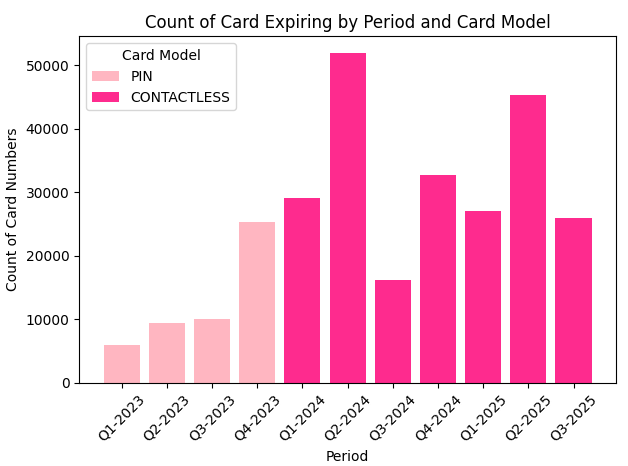
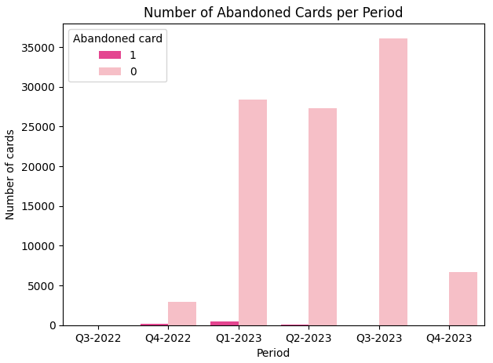
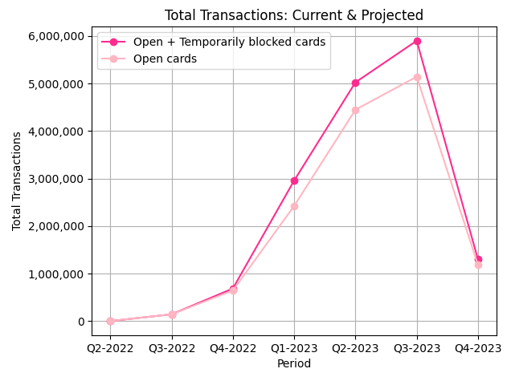

# Flash Case

## 1. Introduction

Construct and report operational metrics on a quarterly basis.

## 2. Result

### Card accounting in each quarter

|  | 1º TRI/2023 |  |  | 2º TRI/2023 |  |  | 3º TRI/2023 |  |  |
|--|:-----------:|:-:|:-:|:-------:|:-:|:-:|:-----:|:-:|:-:|
|**A. Card**| **Total** | **Open** | **Temporarily Blocked** | **Total** | **Open** | **Temporarily Blocked** | **Total** | **Open** | **Temporarily Blocked** |
| **1. Cards at Beginning of Quarter** | 126807 | 126171 | 636 | 159164 | 155169 | 3995 | 200428 | 196074 | 4354 |
| **2. New Cards Obtained During Quarter** | 32357 | - | - | 41264 | - | - | 53174 | - | - |
| **3. Cards Terminated During Quarter**  | 4686 | - | - | 8687 | - | - | 11061 | - | - |
| **4. Cards at End of Quarter** | 159164 | 155169 | 3995 | 200428 | 196074 | 4354 | 253602 | 248322 | 5280 |
| **5. Cards w/ at Least One Transaction during Quarter** | 128113 | - | - | 155331 | - | - | 174052 | - | - |

### Percentage of contactless cards out of the total number of cards at the end of Q3-2023

| **Card model** | **Percentual** |
|:-|:-:|
| CONTACTLESS | 80% |
| PIN | 20% |

### Strategies to increase the contactless card rate by the end of Q4-2023

🎯 Stop issuing PIN cards.

🎯 Almost 100% of PIN cards will expire by the end of Q4-2023. It will be possible to eliminate PIN cards by not issuing new cards in this model and encouraging the switch to CONTACTLESS.

### How to improve card activation and use

💡 Few cards go 90 days or more (a quarter) without being reactivated.

🎯 To combat abandonment, we can talk to customers to understand what success means to them and whether they are achieving this with the product. CSAT and NPS surveys can help in this process.

### ‘Temporarily blocked’: direct impacts on the operation and recommendations for dealing with this situation

🤔 If a high rate of TEMPORARILY_BLOCKED cards were noticed, the first obvious impact would be on the number of transactions because these cards would not be enabled for this.

My recommendations would be:

* Identify the reasons for the blocking;
* Review the reactivation process to see if there are any blockages;
* Carry out qualitative research with users;

In the graph below you can see the projection of transactions considering temporarily blocked cards, as if they weren't blocked, and the total number of open card transactions.

### Dealing with a large number of cards expiring in the next quarter

🤔 If a large number of cards are expiring in a given quarter (e.g. Q2-2024) the recommendations would be:

* Ensure that the reactivation process for card exchange is optimized;
* Work together with CRM to contact customers to make them aware of the card's expiry date;
* And monitor card revalidation;

## 3. Considerations and Assumptions

During the analysis some considerations and assumptions were made:

- **Documentation:** The analysis followed the rules and definitions provided in the “Issuing Definitions” document.

- **Abandoned cards:** Those with the status TEMPORARILY_BLOCKED for 90 days or more were defined. This definition is arbitrary and used only for analysis purposes, so it can be redefined by the Business team.

## 4. Development of the Solution
  

The analysis was carried out using the following steps:
1. **Data Collection:** Google Drive repository.

2. **Data Cleaning and Preparation:** 

    * Missing data related to company_id and employee_id were not processed because they were not essential to the analysis.

    * Date variables have had their data types changed.

    * New variables were created to help analyze the data.

3. **Data exploration**

4. **Interpretation of Results:** The data was analyzed to answer the proposed questions.

## Author

## License

